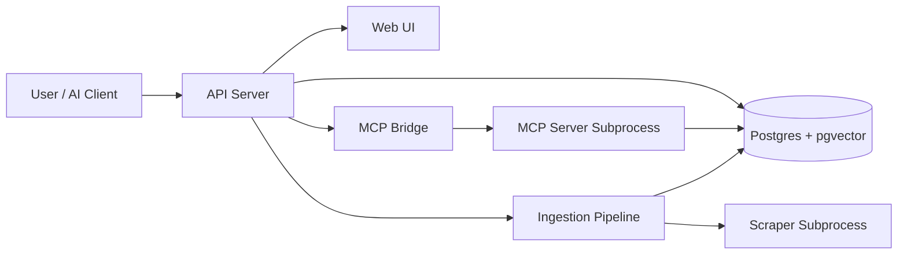

# docs-rag

`docs-rag` turns any framework documentation site into a semantic-searchable
corpus. Crawl a docs site → extract markdown → chunk, embed (local or OpenAI)
and store in Postgres+pgvector → search by *meaning*, not just keywords.
Optionally serve it as an MCP server so AI clients can call it as a tool.

## Quick start

```bash
git clone ... docs-rag && cd docs-rag
python -m venv .venv && source .venv/bin/activate
pip install -e ".[local]"        # add "[openai]" for cloud embeddings, "[dev]" for tests
docker compose up -d             # postgres + pgvector
cp .env.example .env && $EDITOR .env
```

Index a site and ask it a question:

```bash
.venv/bin/python scripts/demo.py        # ingests pydantic docs and runs sample queries
# …or:
.venv/bin/python -m docs_mcp.scraper.runner --url https://docs.pydantic.dev/latest/ --depth 1 --max-pages 6 > pages.jsonl
```

Search it (via CLI/API/MCP/web):

```bash
curl 'http://localhost:8000/search?q=how+do+I+install+pydantic&mode=hybrid'
curl http://localhost:8000/sources
```

## Architecture



## Run modes

| mode | starts | use |
|---|---|---|
| `.venv/bin/docs-mcp-server` | MCP server on stdin/stdout | plug into Claude, Cursor, etc. (`background=true` returns a job id immediately) |
| `.venv/bin/docs-mcp-api` | web UI `http://127.0.0.1:8000` + REST API | browser search / `POST /ingest` (`"background":true` → 202, poll `GET /jobs/{id}`) |
| `scripts/demo.py` | nothing | drive the library directly from Python |

## Tools / endpoints

| MCP tool | REST | What it does |
|---|---|---|
| `add_documentation(name, version, base_url, max_depth=2, max_pages=30, background=false, prune_missing=false)` | `POST /ingest` | Crawl + index a docs site. `background=true` returns a job id; `prune_missing=true` deletes pages not seen in this crawl (use only with uncapped crawls). |
| `search_documentation(query, name?, version?, k=5, mode="hybrid")` | `GET /search` | Semantic search. `mode` = `hybrid` (vector + keyword, RRF-fused, default) · `vector` · `keyword`. |
| `list_sources()` | `GET /sources` | Indexed sources with page/chunk counts |
| `get_ingest_status(job_id)` | `GET /jobs/{id}` | Progress/live counters of a background job |
| — | `GET /jobs` | Recent job history |
| — | `DELETE /sources/{source_id}` | Wipe one indexed source |

## Incremental re-crawl

Re-ingesting an existing `{name}@{version}` source only re-chunks/re-embeds
pages whose extracted markdown changed (sha256); skipped pages are reported as
`pages_unchanged`. Existing rows get backfilled on first re-run.

## Embedding providers

Set `EMBEDDING_PROVIDER` in `.env`: `openai` (needs key), `local` (offline
sentence-transformer). Config knobs: `LOCAL_EMBEDDING_MODEL`,
`LOCAL_EMBEDDING_MAX_TOKENS` (default 1024), `LOCAL_EMBEDDING_DEVICE`
(`auto`/`cuda`/`cpu`). Switching providers with a different vector dimension
requires dropping and re-creating the `documents` table.

## Tests

```bash
.venv/bin/pytest                 # unit tests (no external services)
```

## Notes / caveats

- Background jobs are **in-memory** — lost on restart.
- The web UI can search via the RAG path or through the MCP path (its own
  subprocess) via the backend toggle — handy for comparing the two.
- The scraper strips query strings and follows only same-host links; crawls
  obey robots.txt.