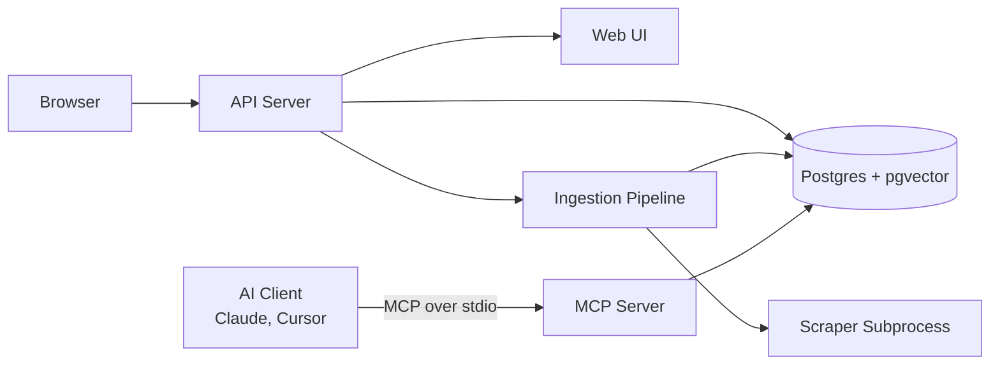

# fathom-mcp

`fathom-mcp` turns any framework documentation site into a semantic-searchable
corpus. Crawl a docs site → extract markdown → chunk, embed locally
(HuggingFace) and store in Postgres+pgvector → search by *meaning*, not just
keywords. Serve it as an MCP server so AI clients can call it as a tool, or use
the REST API and web UI.

## Quick start

**Prerequisites:** Python ≥ 3.12, Docker, Node.js (optional, for sanitizer checks).

```bash
git clone ... fathom-mcp && cd fathom-mcp
python -m venv .venv && source .venv/bin/activate
pip install -e ".[local]"        # add "[dev]" for tests + sanitizer checks
docker compose up -d             # postgres + pgvector on localhost:5432
cp .env.example .env             # edit .env — set LLM_API_KEY at minimum
```

The database is created automatically on first query. No manual migration needed.

Index a site and search it:

```bash
.venv/bin/docs-mcp-api             # starts API + web UI on http://127.0.0.1:8000
# in another terminal:
curl 'http://localhost:8000/search?q=how+do+I+install+pydantic&mode=hybrid'
```

Or run the demo script (ingests pydantic docs, runs sample queries):

```bash
.venv/bin/python scripts/demo.py
```

## Architecture



## Project layout

```
src/docs_mcp/
├── api.py            REST API + web UI server (Starlette)
├── chat.py           Detects "download X docs" requests in chat messages
├── config.py         All settings, read from .env
├── jobs.py           Background crawl jobs with live progress counters
├── llm.py            Chat answers via any OpenAI-compatible LLM API
├── pipeline.py       Orchestrates one ingest: crawl → extract → chunk → embed → store
├── server.py         MCP server exposing 5 tools for AI clients
├── embeddings/       Text → 1024-number vectors (local HuggingFace model)
├── processing/       HTML → Markdown cleanup, and markdown → chunks splitting
├── scraper/          Web crawler (Scrapy + headless Chrome) and its CLI
└── static/           The web UI (one HTML file)
scripts/demo.py       Example: use the library directly from Python
tests/                Unit tests (pytest)
npm/                  npm wrapper for npx distribution
```

## Run modes

| mode | starts | use |
|---|---|---|
| `.venv/bin/docs-mcp-server` | MCP server on stdin/stdout | plug into Claude, Cursor, etc. (`background=true` returns a job id immediately) |
| `.venv/bin/docs-mcp-api` | web UI `http://127.0.0.1:8000` + REST API | browser search / `POST /ingest` (`"background":true` → 202, poll `GET /jobs/{id}`) |
| `npx @fathom-mcp/server` | same as above, auto-setup venv | no local clone needed — first run installs deps |
| `scripts/demo.py` | nothing | drive the library directly from Python |

## Connecting to OpenCode

Add to `~/.config/opencode/opencode.jsonc`:

```json
{
  "mcp": {
    "fathom-mcp": {
      "type": "local",
      "command": ["npx", "-y", "@fathom-mcp/server"]
    }
  }
}
```

Or if running from a local clone:

```json
{
  "mcp": {
    "fathom-mcp": {
      "type": "local",
      "command": ["node", "npm/bin/docs-mcp-server.js"],
      "cwd": "/path/to/fathom-mcp"
    }
  }
}
```

The MCP panel should show `fathom-mcp` with five tools.

Example prompts once connected:

```
search_documentation for "how to define a custom validator"
add_documentation react latest https://react.dev/learn
add_local_docs name="internal-api" path="/path/to/docs"
list_sources
```

## Tools / endpoints

| MCP tool | REST | What it does |
|---|---|---|
| `add_documentation(name, version, base_url, max_depth=2, max_pages=30, background=false, prune_missing=false)` | `POST /ingest` | Crawl + index a docs site. `background=true` returns a job id; `prune_missing=true` deletes pages not seen in this crawl (use only with uncapped crawls). |
| `search_documentation(query, name?, version?, k=5, mode="hybrid")` | `GET /search` | Semantic search. `mode` = `hybrid` (vector + keyword, RRF-fused, default) · `vector` · `keyword`. |
| `list_sources()` | `GET /sources` | Indexed sources with page/chunk counts |
| `get_ingest_status(job_id)` | `GET /jobs/{id}` | Progress/live counters of a background job |
| `add_local_docs(name, path, recursive=true)` | `POST /upload-folder` | Index a local folder of docs (HTML/MD/PDF/TXT) |
| — | `POST /upload` | Upload files via multipart form |
| — | `GET /jobs` | Recent job history |
| — | `DELETE /sources/{source_id}` | Wipe one indexed source |
| — | `GET /about` | System info, stats, version |
| — | `GET /llm-chat?q=...` | Chat with docs via LLM |

## Incremental re-crawl

Re-ingesting an existing `{name}@{version}` source only re-chunks/re-embeds
pages whose extracted markdown changed (sha256); skipped pages are reported as
`pages_unchanged`. Existing rows get backfilled on first re-run.

## Embeddings & LLM

Embeddings are local (HuggingFace sentence-transformers), with knobs
`LOCAL_EMBEDDING_MODEL`, `LOCAL_EMBEDDING_MAX_TOKENS` (default 1024),
`LOCAL_EMBEDDING_DEVICE` (`auto`/`cuda`/`cpu`) and
`LOCAL_EMBEDDING_MIN_FREE_VRAM_GIB` (default 4 — `auto` falls back to CPU below
this much free VRAM; bge-m3 peaks around 3.7 GiB). Switching to a model with a
different vector dimension requires dropping and re-creating the `documents`
table.

LLM chat answers work with **any OpenAI-compatible provider** via three `.env`
vars: `LLM_API_KEY`, `LLM_BASE_URL`, `LLM_MODEL`. Examples:

| provider | LLM_BASE_URL | LLM_MODEL example |
|---|---|---|
| Gemini | `https://generativelanguage.googleapis.com/v1beta/openai` | `gemini-3.6-flash` |
| OpenRouter | `https://openrouter.ai/api/v1` | `google/gemma-4-31b-it:free` |
| OpenAI | `https://api.openai.com/v1` | `gpt-4o-mini` |
| Anthropic | `https://api.anthropic.com/v1` | `claude-sonnet-4-5` |

## Tests

```bash
.venv/bin/pytest                 # unit tests (no external services)
```

## Notes / caveats

- Background jobs are **in-memory** — lost on restart.
- The scraper strips query strings and follows only same-host links; crawls
  obey robots.txt.
