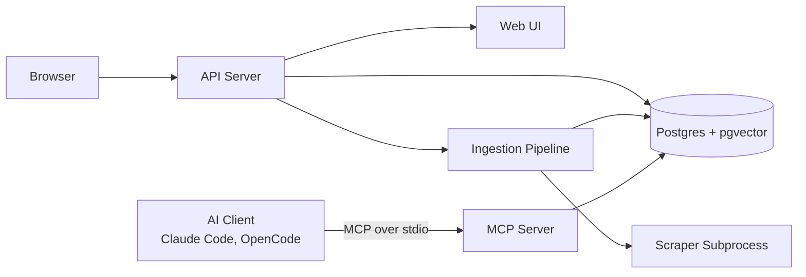

# fathom-mcp

Documentation RAG system: crawl a docs site → chunk + embed locally (HuggingFace)
→ store in Postgres+pgvector → semantic search via MCP server, REST API, and web UI.

## Demo


live at https://fathom-mcp.veermehta.dev

## Architecture



## Quick start

```bash
git clone ... fathom-mcp && cd fathom-mcp
python -m venv .venv && source .venv/bin/activate
pip install -e ".[local]"
docker compose up -d
cp .env.example .env              # set LLM_API_KEY
.venv/bin/docs-mcp-api            # http://127.0.0.1:8000
```

## npm (no clone needed)

```bash
npx @fathom-mcp/server            # first run installs ~5GB deps, then instant
npx @fathom-mcp/server --api      # REST API + web UI
```

## MCP tools

`add_documentation` · `search_documentation` · `list_sources` · `get_ingest_status` · `add_local_docs`

## REST API

| Endpoint | What |
|---|---|
| `GET /search?q=...` | Semantic search |
| `GET /sources` | Indexed sources |
| `POST /upload` | Upload files |
| `POST /upload-folder` | Index a local folder |
| `GET /llm-chat?q=...` | Chat with docs |
| `GET /about` | System info |

## OpenCode

Add to `~/.config/opencode/opencode.jsonc`:

```json
{
  "mcp": {
    "fathom-mcp": {
      "type": "local",
      "command": ["/path/to/fathom-mcp/.venv/bin/python", "-m", "docs_mcp.server"]
    }
  }
}
```

Replace `/path/to/fathom-mcp` with your actual clone path. You can verify it works with:

```bash
echo '{"jsonrpc":"2.0","id":1,"method":"initialize","params":{"protocolVersion":"2024-11-05","capabilities":{},"clientInfo":{"name":"test","version":"1.0"}}}' | /path/to/fathom-mcp/.venv/bin/python -m docs_mcp.server
```

## Config

`~/.fathom-mcp/.env` — set `EMBEDDING_PROVIDER=api` + `EMBEDDING_API_KEY` for remote embeddings (Jina, OpenAI, etc.), or leave as `local` for HuggingFace.
